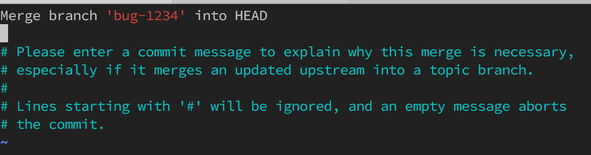

## Basic git workflow

This document assumes you have already done the basic set-up steps documented in [getting started](getting-started.md). It also assumes you have a *Stash* account and that you have registred your public key with your account in *Stash*

Here we cover the steps required to do basic development with one of the repositories in the *Zimbra* project.

## Fork the repo

For the purpose of this walkthrough we will use the `zm-zcs` repo as an example.  For each repo in the *Zimbra* project that you will contribute to, the first step is to "fork" the repository. This is something you have to do only one time.  Your fork of a repo will be associated with your *Stash* account. And currently, when you create a fork, only you can "see" it.

Navigate to the `zm-zcs` repo in the *Zimbra* project via the *Stash* web interface.  Hover over the *more options* icon on the left side and select the *Fork* option.

Just keep the default options and click *Fork repository*.

The UI will then open your fork of the repo. Again, hover over the *more options* icon, but this time choose the *Clone* option.

You will be presented with a dialog that looks as follows.  You one to copy the URL that is displayed to your clipboard as you will need it for the next step.

## Check out a local copy of your fork

Navigate to your local directory that you are using for ZCS development.  Then checkout a copy of your fork by entering the following command.  Note that `FORK-URL` should be replaced with the URL of your fork that you copied to your clipboard in the previous step.

	$ git clone FORK-URL

    Cloning into 'zm-zcs'...
    remote: Counting objects: 66, done.
    remote: Compressing objects: 100% (63/63), done.
    remote: Total 66 (delta 20), reused 0 (delta 0)
    Receiving objects: 100% (66/66), 13.07 KiB | 0 bytes/s, done.
    Resolving deltas: 100% (20/20), done.
    Checking connectivity... done.

CD into your local fork and look around a bit. Again `FORK-URL` will be the URL of *your* fork.

    $ cd zm-zcs
	$ ls

    ant-global.xml  ivysettings.xml

    $ git branch
	
    * master
	
    $ git remote -v

    origin  FORK-URL (fetch)
    origin  FORK-URL (push)

From the above we can see that there are two files in the repo.  There is one local branch, called `master`. The asterick in front of the local branch label means that it is the active branch.  But what about the last command?  The `git remote` command with the `-v` (verbose) option lists all of the remotes that you have registered with your local copy of the repository.  When you clone a repository, git automatically registers the repo that you cloned.  All remotes have a label associated with them, for convenience, and git uses the label `origin` in this case.

By the way, you can change labels for a remote, or change the url associated with a remote label, at any time.  See the output of `git help remote` for more info.

## Creating a branch

You will typically have a ticket associated with work that you do.  The first step is to create a branch for the work you are doing.  

	$ git checkout -b bug-1234 master
	
	Switched to a new branch 'bug-1234'

Here we create a branch called `bug-1234` based off of our local branch named `master`.  Before we continue, let's talk a bit more about branches in git.

All changes to code in a git repository is done via a series of commits that are modelled as a directed acyclic graph (DAG).  There is plenty of information on the 'net that talks about this and I recommend you do a bit of reading if this topic is of interest.

When you commits changes to a file or files, git does a hash of the diffs (based on the previous commit), along with some associated metadata. That hash uniquely identifies the commit.  Tags and branches in git are a convenience.  They provide human-friendly aliases for various commit hashes in the repository.

When examining a repository you will see both full hashes, as in the following...

    $ git log -n 1
    
    commit 4d0dbeb050cc3f3585b0f63ed40b9280fa1c885a
    Merge: 50e5508 21ea250
    Author: ilya <raykini@zimbra.com>
    Date:   Thu Jul 21 14:17:51 2016 -0700
    
        bug 105975 - added include/exclude params

And you will see abbreviated hashes, like so...

    $ git log --graph --decorate --pretty=oneline --abbrev-commit -n 1
    *   4d0dbeb (HEAD, origin/master, origin/HEAD, master, bug-1234) bug 105975 - added include/exclude params

In any command that refers to a specific commit, you can use the full hash, the abbreviated hash, or any label that has been associated with that commit. So, in the commit that is show above, all of the following values refer to the same commit:

- `4d0dbeb050cc3f3585b0f63ed40b9280fa1c885a` (the full commit hash)
- `4d0dbeb` (the abbreviated commit hash)
- `HEAD` (the label that is maintained by git as an alias for the "current" commit that is reflected in the working tree).
- `origin/master` (the branch called "master" in the remote labelled "origin")
- `origin/HEAD` (the "current" HEAD in the remoted labelled "origin")
- `master` (your local branch called "master")
- `bug-1234` (your local branch called "bug-1234")

A couple of additional observations:

- Remote branch labels are always comprised of two parts `REMOTE-LABEL/BRANCH-NAME`
- Local branch labels are always just a single value `BRANCH-NAME`
- They may be an arbitrarily large number of branch labels (and tags) associated with any commit.

## Do some work

For this walkthrough, we will just make some random changes that are associated with our mythical bug `1234`.  (OK, there probably is a bug `1234` in Bugzilla and we will just ignore that fact for now.)

### Add a README file

By convention, all git repositories contain a README file at the top level.  This can be in many different formats; however, markdown is the most popular.  Our repo doesn't have a `README.md` so let's add one.  For the purposes of this walkthrough we are not concerned with the actual changes peformed during the following steps:

- Edit `README.md`
- Add some text.
- Save changes and exit.

Now we have to tell git to track changes to this new file.  We do this in two steps:

    $ git add README.md
    $ git commit

The second command will open a temporory file in your registered `$EDITOR` that allows you to enter a commit message.  This is what that buffer looked like just before I saved the changes.  You will notice that the bulk of the explanatory text has nothing to do with the change.  I included it as an opportunity to document some important conventions regarding well-crafted commit messages in git, so please make note of them.

    bug 1234 - added README.
    
    Please note that the first line of any commit message in `git` should
    not exceed 50 characters in total length.  Any additional information
    should be provided by adding as many additional lines as you require.
    
    There should be ONE blank line between the first line of the commit
    message and any subsequent lines.  Any lines that start with `#` are
    comments that were inserted by git and are not included in the actual
    commit message.
    
    When committing changes associated with a bug, as we are doing here, you
    should include the bug number using the formatting options as defined by
    the system you are working with.  I do not believe the commit hooks have
    been established yet for our Stash repos, but once they are, we should
    be sure to follow the conventions for including bug numbers in the
    commit messages that are required by the commit hook.
    
    # Please enter the commit message for your changes. Lines starting
    # with '#' will be ignored, and an empty message aborts the commit.
    # On branch bug-1234
    # Changes to be committed:
    #       new file:   README.md

Once you save your changes and exit, your change has been make and you will see it reflected in the history of your local repository.  If you have added the aliases that I talk about in the [getting started](getting-started.md) doc, you will be able to do the following:

	$ git lala

The alias I used expands to the following command...

    $ git config --get alias.lala
	
    log --graph --decorate --pretty='format: %Cblue%h%Creset [%an]%Cred%d %Cgreen%s' --abbrev-commit --all

...so instead of typing `git lala` I could have typed the following:

	$ git log --graph --decorate --pretty='format: %Cblue%h%Creset [%an]%Cred%d %Cgreen%s' --abbrev-commit --all

And now you see why we use aliases.

Another handy alias will show you all the files that were added, changed, or deleted between any two commits. Example:

    $ git dt HEAD~1 HEAD
    
    :000000 100644 0000000000000000000000000000000000000000 f053949e871909017431f19f8a5f0ef7b9585036 A      README.md

The `dt` alias expands to this:

    $ git config --get alias.dt
    
    diff-tree -r

Some comments:

- The `git diff-tree` command expects a starting commit and an ending commit.
- As explained before `HEAD` refers to the current, active commit.
- `HEAD~n` is shorthand way to refer to the *n'th* parent of `HEAD`, so `HEAD~1` is the immediate parent.
- The third item in the list is the previous hash of the object.  Forty zeros, as we have here, is a null commit hash because this was a new object that we added.
- The fourth item in the list is the current hash of the object.

You can ask git to display the current hash of any object in the tree as follows:

    $ git hash-object README.md
    
    f053949e871909017431f19f8a5f0ef7b9585036

And you can see the value returned by `git hash-object` corresponds to the value returned by `git diff-tree`.

### Add some more changes

I am going to add a couple more random changes and commit them.  After completing the work we have this:

## Creating a pull request

We are ready to create a pull request to have our changes reviewed.  The first step is to push your work out to your fork.

	$ git push origin bug-1234

    Counting objects: 41, done.
    Delta compression using up to 8 threads.
    Compressing objects: 100% (32/32), done.
    Writing objects: 100% (41/41), 5.95 KiB | 0 bytes/s, done.
    Total 41 (delta 13), reused 31 (delta 9)
    remote:
    remote: Create pull request for bug-1234:
    remote:   https://stash.corp.synacor.com/users/gordon.tillman/repos/zm-zcs/compare/commits?sourceBranch=refs/heads/bug-1234
    remote:
    To ssh://git@stash.corp.synacor.com:7999/~gordon.tillman/zm-zcs.git
     * [new branch]      bug-1234 -> bug-1234

This is what your tree looks like now:

Notes:

- The `git push` command expects a couple of arguments.
  - The remote to push to.  You can use the full URL or the helpful label for the remote.  As we know, `origin` is the label of our fork.
  - The *source* and *destination* references.
- The full syntax for the command is `git push REMOTE SRC:DEST`.  If you specify a single value as we did, it is the same as this: `git push origin bug-1234:bug-1234`.

Now you must go to your fork via the web interface and generate your pull request.

Log back into `https://stash.corp.synacor.com`, click on your icon in the upper-right corner, and select *View Profile*.

You should see all of your forks and other personal repositories that you may have created.

Click on the fork you are working with. In this case it is `zm-zcs`, hover over the *more options* icon, and select the *Create pull request* option.

Be sure and select the branch from your fork that you are working with  and the branch in the main repo you wish to merge to, then click *Continue*.

Update pull request notes as required, then click the *Create* button. 

## Updating your pull request

If you get suggestions for changes to your pull request, just do the following:

- Implement the changes in your local clone of the fork.
- Add and commit your changes as before.
- Push your bug branch back to your fork as before.  That will automaticaly update the code in the pull request.

## Merging your pull request

Assuming your pull request gets approved, and assuming your account has permissions to do so, you may be asked to merge your pull request.  Here are the steps to follow to accomplish that.

You need to add the main repo as a remote in your local repo.  To do this, just navigate to the main repo via the web interface and copy the clone URL of it in the same way as you did for your fork.

Then add the main repo as a remote in your local copy as follows.  Here I have assigned the label `upstream` to this new remote.  You can use whatever you like.

	$ git remote add upstream ssh://git@stash.corp.synacor.com:7999/zimbra/zm-zcs.git

Now you must fetch the state of the new remote:

	$ git fetch upstream

    remote: Counting objects: 31, done.
    remote: Compressing objects: 100% (18/18), done.
    remote: Total 19 (delta 8), reused 0 (delta 0)
    Unpacking objects: 100% (19/19), done.
    From ssh://stash.corp.synacor.com:7999/zimbra/zm-zcs
     * [new branch]      105454     -> upstream/105454
     * [new branch]      105752     -> upstream/105752
     * [new branch]      master     -> upstream/master

Before merging your pull request you have to do two things:

- Verify that the branch your changes were based on has not been updated.
- Group your commits (if you made more than one commit) so they are organized properly.

### Verifying your base branch is the same

	$ git lala

Comments:

- Remember that *origin* is the remote label for your fork and that *upstream* is the remote label for the main repository.
- Noticed that the commits for your branch, `bug-1234` are no longer based on top of the `upstream/master` branch.  This is because other pull requests were merged before yours.  So you *must* rebase your pull request before merging it.

### Rebasing your pull request

From the above diagram you can see that you still have your branch checked out.  So all you need to do is this:

	$ git rebase upsteam/master

If any conflicts occur, you resolve as follows for each file that exhibits a conflict:

- Edit the file that has a conflict and save your changes.
- Do a `git add FILENAME` for the file that you edited.
- Do a `git rebase --continue` to allow the rebase operation to continue.

In our example there was a conflict in the `ivysettings.xml` file.

- I edited the file and resolved the conflict.
- Then `git add ivysettings.xml`.
- Then `git rebase --continue`.

By the way, if you get flummoxed and do now know how to resolve the conflicts, just issue a `git rebase --abort` to return your local repo to the state it was in before issuing the `git rebase upstream/master` command and ask for help.

Here is what the local repo looks like after the rebase operation.

	$ git lala

Notes:

- The three commits we did for our pull request are all nicely rebased onto the *current* state of `upstream/master`.
- The commit hashes of our commits have changed.  This is normal after a rebase.  Remember, *each commit* is based of the state of the repo in the *previous* commit.  Rebasing, as the name implies, means that you are changing the first commit that your changes are based upon.

### Grouping your commits

Since the work we did contained more than one commit, we need to group all of our commits together before submitting so they will be nicely organized and it will be absolutely clean what work was done for the bug.  To do this, we are going to check-out the `upstream/master` branch and do a *non-fast-forward merge* of our new changes. 

In the steps that follow, I am going to show you the effect of each command on your history.  Normally you would not be issuing all of these extra commands. I just want to make sure you underand what is going on.

Check-out the `upstream/master` branch.

	$ git checkout upstream/master

The new history.  Notice that `HEAD` has moved from your `bug-1234` branch down to the `upstream/master` branch, as expected.

Do a non-fast-forward merge of your bug branch.

	$ git merge --no-ff bug-1234

You will be presented with a commit edit session.  Doing a non-fast-forward merge creates an essentialy empty commit that serves just to mark the merge operation.  This is the default message I was presented with:

You can leave it as is or you can put in something more meaningful.  Just remember to *keep the first line short* (no more that 50 characters), followed by a blank line if necessary, then whatever additional notes you may wish to include.

Save your commit message changes and exit.  The new history:

You can see that all of your commits are now nicely grouped.  All that is left is do do a bit of housekeeping and push in your changes.

You can see that your local `master` branch is way down on commit `4d0dbeb`.  Let's move it up to the `HEAD` and check it out.

	$ git branch -f master HEAD
	$ git checkout master

Here is the new history:

Looks good.  Next thing we should do, and this is just to make *Stash* happy, is to update your `bug-1234` branch in your fork.  We are going to delete it shortly, so why bother? The *only* reason is this.  Since we had to rebase your changes (due to `upstream` having changed since you created your fork), if we simply push our changes to upstream, *Stash* will not recognize the fact that you have merged your pull request and you will have to go in and manually close it.  So the next command illustrates two things:

	$ git push origin +HEAD:bug-1234
	...
	 + 330117a...198c00a HEAD -> bug-1234 (forced update)

Notes:

- We have updated the bug branch in our fork (`origin`), so that when we merge it into `upstream` *Stash* will recognize that the pull request has been merged.
- Notice the use of a `+` before the *source* branch.  This is because we re-wrote history (only in our local repo) when we rebased our changes, so the merge into the fork would otherwise be rejected.  This is what the rejected merge message would have looked like:

        $ git push origin HEAD:bug-1234
        To ssh://git@stash.corp.synacor.com:7999/~gordon.tillman/zm-zcs.git
         ! [rejected]        HEAD -> bug-1234 (non-fast-forward)
        error: failed to push some refs to 'ssh://git@stash.corp.synacor.com:7999/~gordon.tillman/zm-zcs.git'
        hint: Updates were rejected because a pushed branch tip is behind its remote

What does our history look like now?

	$ git lala

The final steps are as follows:

- Merge our pull request into `upstream`
- Delete our local bug branch
- Delete our bug branch in our fork
- (optional) Update the master branch in our fork.

I'll do all of them before showing one last look at the history.

	$ git push upstream master
	$ git branch -D bug-1234
	$ git push origin :bug-1234
	$ git push origin master

A few final comments.

- Notice that all off the repositories are in sync
  - Your local repo
  - Your fork in *Stash* (`origin`)
  - The main repo in the *Zimbra* project in *Stash* (`upstream`)
- The work we did is nicely grouped together

The goal here is to make *all* pull requests that are merged look like that.
