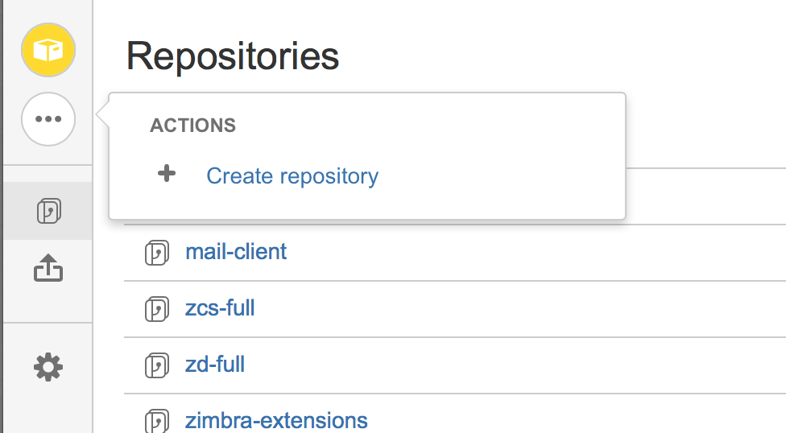
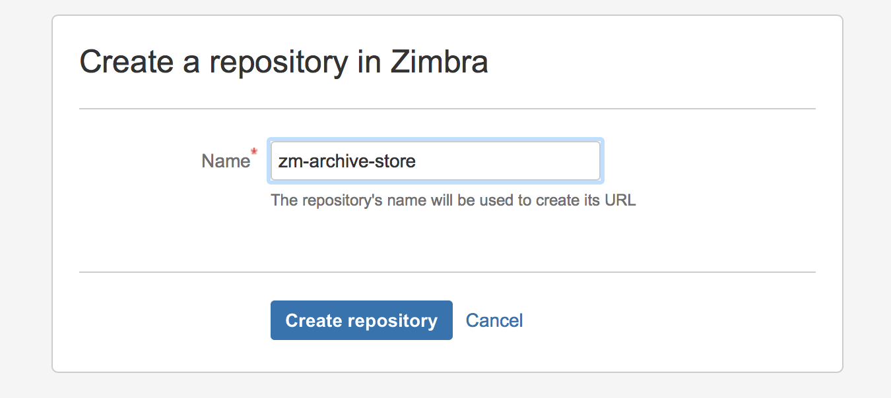
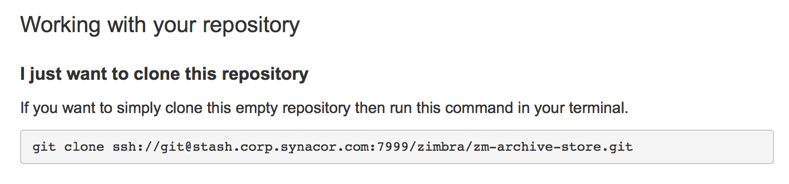

# Creating a new repo in stash

Note that your account must have adequate permissions in order to create a new repository in stash.

Go to the [Zimbra project on stash](https://stash.corp.synacor.com/projects/ZIMBRA). You must be connected to the Synacor VPN to do this.

Hover over the dots on the left and select *Create repository*

Enter an appropriate name for the new repostory and select *Create repository*.

Make note of the URL that was generated so that you can clone/pull from or push to your new repository.

